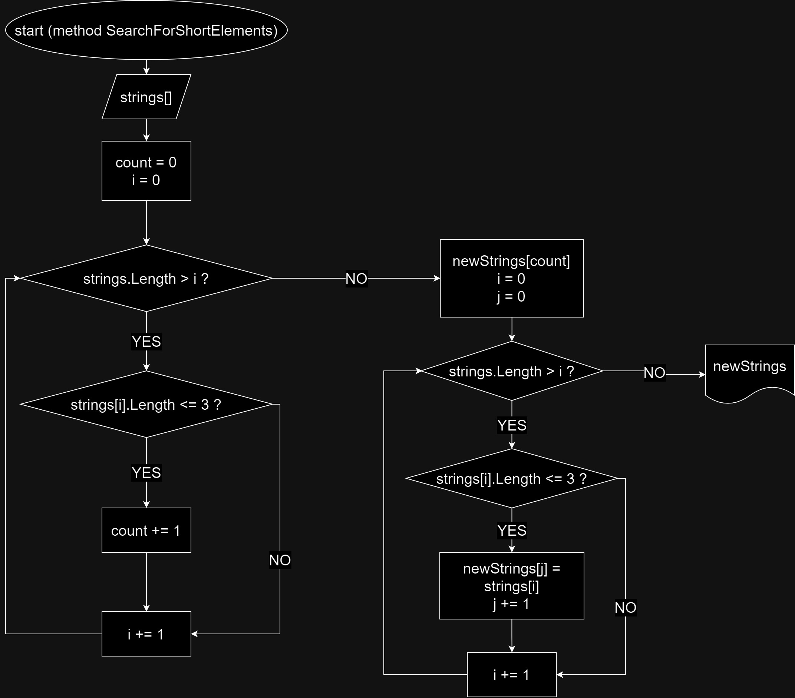

## Итоговая контрольная работа

1. Создать репозиторий на GitHub
2. Нарисовать блок-схему алгоритма (можно обойтись блок-схемой основной содержательной части, если вы выделяете её в отдельный метод)
3. Снабдить репозиторий оформленным текстовым описанием решения (файл README.md)
4. Написать программу, решающую поставленную задачу
5. Использовать контроль версий в работе над этим небольшим проектом (не должно быть так, что всё залито одним коммитом, как минимум этапы 2, 3, и 4 должны быть расположены в разных коммитах)

### Задача: 
Написать программу, которая из имеющегося массива строк формирует новый массив из строк, длина которых меньше, либо равна 3 символам. Первоначальный массив можно ввести с клавиатуры, либо задать на старте выполнения алгоритма. При решении не рекомендуется пользоваться коллекциями, лучше обойтись исключительно массивами.

### Выполнение:

#### 1. Метод PromptStringArray

Этот метод принимает сообщение для пользователя, после чего ждёт ввод массива. С помощью метода Split() преобразовывает строку в массив через разделитель "," и возвращает полученный массив.

#### 2. Метод SearchForShortElements

В методе происходит поиск элементов с длиной <= 3. В начале считается количество таких элементов, чтобы иметь возможность создать новый массив. Далее новый массив заполняется нужными элементами.

#### 3. Метод OutputArray

Вывод нового массива.

### Блок-схема:

